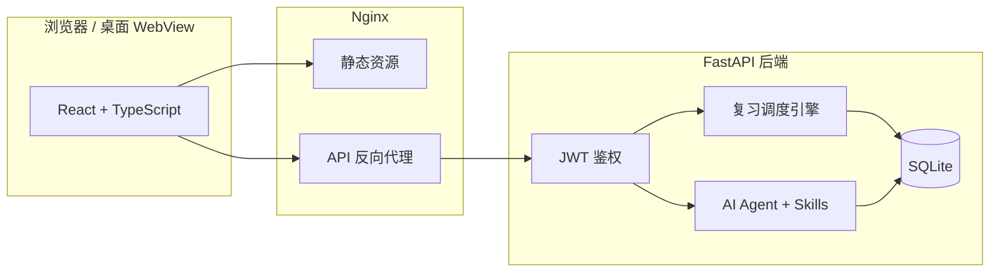

<div align="center">


<h1>忆刻 · YiKe</h1>

<p><b>科学复习，刻进记忆</b></p>

<p>
一款面向长期学习者的智能复习系统。<br />
以艾宾浩斯遗忘曲线为核心，覆盖卡片、单词、易混词三类内容，<br />
支持 Web 部署与 Windows 桌面版，并内置 AI 助手协同管理你的学习计划。
</p>

<p>
<a href="#-快速开始"></a>
<a href="backend/"></a>
<a href="frontend/"></a>
<a href="frontend/"></a>
<a href="https://github.com/wx971025/yike/releases/latest"></a>
</p>

<p>
<a href="#-快速开始">快速开始</a> ·
<a href="#-功能亮点">功能亮点</a> ·
<a href="#-记忆策略">记忆策略</a> ·
<a href="#️-windows-桌面版">桌面版</a> ·
<a href="#-架构概览">架构</a> ·
<a href="#-本地开发">本地开发</a>
</p>

</div>

---

## 产品简介

**忆刻** 帮助你把「学过」变成「记住」。

你只需要记录学习内容并加入复习计划，系统会按科学的节奏在正确的时间提醒你复习——未完成的复习不会悄悄溜走，逾期的卡片会醒目提示，直到你真正掌握为止。

无论是备考知识点、语言单词，还是日常碎片化学习，忆刻都能提供清晰、可执行的复习路径。

---

## ✨ 功能亮点

### 🔁 复习引擎

| 能力 | 说明 |
|------|------|
| **今日复习** | 聚合待复习的卡片、单词与易混词，支持分组筛选与进度追踪 |
| **双轨记忆策略** | 每组可选「艾宾浩斯间隔复习」或「连续巩固」（7 / 15 / 30 天每日复习） |
| **逾期提醒** | 到期未复习的内容持续出现在待办列表，并高亮逾期天数 |
| **复习日历** | 月历视图预览未来安排，按分组查看完整复习路径 |
| **遗忘曲线** | 可视化记忆留存趋势，辅助理解当前复习轮次 |

### 🗂 内容管理

| 能力 | 说明 |
|------|------|
| **普通卡片** | 自定义标题与说明，灵活记录任意知识点 |
| **单词卡片** | 释义、音标、词性、例句，支持内置词典辅助录入 |
| **易混词** | 成对管理易混淆词汇，专项对比记忆 |
| **分组管理** | 按学科 / 考试 / 项目组织内容，独立配置记忆方式 |
| **计划与批量** | 分栏管理已入计划的内容，多选加入 / 移出，效率优先 |
| **数据备份** | 一键导出 / 导入完整学习数据（含日期与轮次），轻松跨平台迁移 |

### ✍️ 单词复习体验

- **释义 → 拼写** 沉浸式复习流程，专注记忆提取
- **乱序 / 顺序** 可切换的复习队列
- **复古打字机音效** 按键、空格、回车独立音效，一键静音
- **专注放大模式** 隐藏干扰元素，保留进度与控制栏
- **快捷键** 回车 / 空格确认，流畅连贯的复习节奏

### 🤖 AI 助手

- 悬浮对话入口，用自然语言管理分组、卡片、单词与复习计划
- 支持 `@分组名` 精确指定操作范围
- 可配置自定义大模型（OpenAI 兼容接口）
- **Agent 技能**：可扩展的工作方式，让助手更懂你的习惯

### 🔐 账户与安全

- 用户名 + 密码注册登录，JWT 鉴权
- 用户资料与头像管理
- 生产环境可通过环境变量配置密钥

---

## 🧠 记忆策略

忆刻支持按**分组**选择最适合的记忆方式。

### 艾宾浩斯 · 间隔复习

以学习日为第 1 轮（当天复习），按科学间隔推进后续轮次：

```
第 1 轮  ·  当天（学习日）
第 2 轮  ·  3 天后
第 3 轮  ·  7 天后
第 4 轮  ·  15 天后
第 5 轮  ·  30 天后
第 6 轮  ·  60 天后
第 7 轮  ·  180 天后
```

完成全部轮次后，内容标记为「已掌握」。

### 连续巩固 · 每日复习

适合需要密集强化的场景（如考前冲刺、短期突破）：

| 模式 | 节奏 |
|------|------|
| 连续巩固 · 7 天 | 连续 7 天每日复习 |
| 连续巩固 · 15 天 | 连续 15 天每日复习 |
| 连续巩固 · 30 天 | 连续 30 天每日复习 |

---

## 🖥️ Windows 桌面版

除 Web 部署外，忆刻提供开箱即用的 **Windows 原生桌面版**：

- **双击即用**：原生窗口 + 免登录，直接进入主界面
- **本地优先**：前后端本地运行，数据存于 `%LOCALAPPDATA%\YiKe\data\`
- **托盘常驻**：关闭窗口最小化到系统托盘，后台继续运行
- **词典按需下载**：英文词典（约 200MB）不预装，应用内「下载管理」按需获取
- **应用内更新**：设置 → 检查更新，自动下载并安装新版本

> 前往 [Releases](https://github.com/wx971025/yike/releases/latest) 下载最新 `YiKeSetup.exe`。
> 构建与打包细节见 [`windows-desktop/README.md`](windows-desktop/README.md)。

---

## 🏗 架构概览



**技术栈**

| 层级 | 技术选型 |
|------|----------|
| 前端 | React 18 · TypeScript · Vite · Tailwind CSS |
| 后端 | Python 3.11 · FastAPI · SQLAlchemy |
| 数据 | SQLite（Docker Volume 持久化） |
| 部署 | Docker Compose · Nginx · Asia/Shanghai 时区 |
| 桌面 | PyWebview · WebView2 · PyInstaller · Inno Setup |
| AI | OpenAI 兼容 API · 可配置模型与端点 |

---

## 🚀 快速开始

### 环境要求

- Docker & Docker Compose
- 可选：Node.js 20+、Python 3.11+（本地开发）

### 一键部署

```bash
git clone https://github.com/wx971025/yike.git
cd yike

./deploy.sh
```

启动后访问 **http://localhost:10001**

> 首次使用 AI 功能前，请在应用内 **设置 → AI 配置** 填写 API Key 并通过连通测试。

### 部署脚本

```bash
./deploy.sh          # 部署前后端
./deploy.sh frontend # 仅前端
./deploy.sh backend  # 仅后端
```

### 生产环境建议

```bash
JWT_SECRET=your-strong-random-secret ./deploy.sh
```

> 数据默认保存在 Docker Volume `db_data` 中，容器重启不会丢失。删除 Volume 将清空全部数据，请谨慎操作。

---

## ⚙️ 环境变量

| 变量 | 说明 | 必填 |
|------|------|------|
| `JWT_SECRET` | JWT 签名密钥 | 生产环境必填 |

> AI 接口（Base URL、API Key、Model）请在应用内 **设置 → AI 配置** 中填写，并通过连通测试后使用。

---

## 💻 本地开发

<table>
<tr>
<td width="50%" valign="top">

**后端**

```bash
cd backend
python3 -m venv .venv
source .venv/bin/activate
pip install -r requirements.txt
DATABASE_URL="sqlite:///./dev.db" \
  uvicorn app.main:app --reload --port 8000
```

</td>
<td width="50%" valign="top">

**前端**

```bash
cd frontend
npm install
npm run dev
```

开发服务器默认 **http://localhost:5173**
（已代理 API 至 `localhost:8000`）

</td>
</tr>
</table>

---

## 📁 项目结构

```
yike/
├── deploy.sh                 # 一键部署脚本
├── docker-compose.yml        # 容器编排（含 Asia/Shanghai 时区）
├── docs/assets/              # 品牌资源
├── backend/
│   └── app/
│       ├── routers/          # API 路由（复习、单词、易混词、AI、词典…）
│       ├── services/         # 复习引擎、AI、词典等业务逻辑
│       ├── dates.py          # 北京时间日期处理
│       └── models.py         # 数据模型
├── frontend/
│   ├── public/sounds/        # 单词复习打字机音效（CC0）
│   └── src/
│       ├── pages/            # 复习、卡片、单词、计划、日历…
│       ├── components/       # UI 组件与 AI 助手
│       └── context/          # 全局状态
└── windows-desktop/          # Windows 桌面版打包工程
```

---

## 📌 设计原则

- **到期必现** — 只要没标记「已复习」，到期内容就会持续出现，不会被静默跳过
- **分组自治** — 不同学习场景可使用不同记忆策略，互不干扰
- **复习优先** — 今日复习页是核心入口，缩短从「记录」到「巩固」的路径
- **克制打扰** — AI 助手、音效、放大模式均可按需开关，不绑架你的注意力

---

<div align="center">

<br />

**忆刻** — 把复习变成习惯，把记忆刻进日常。

<sub>Made with care for learners who refuse to forget.</sub>

</div>
