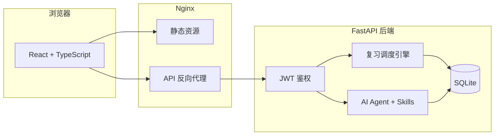

<div align="center">


<br /><br />

# 忆刻 YiKe

**科学复习，刻进记忆**

一款面向长期学习者的智能复习系统。支持艾宾浩斯间隔复习与连续巩固两种记忆策略，覆盖普通卡片与单词拼写复习，并内置 AI 助手协同管理你的学习计划。

<br />

[](docker-compose.yml)
[](backend/)
[](frontend/)
[](frontend/)
[](backend/)

<br />

[快速开始](#-快速开始) · [功能亮点](#-功能亮点) · [记忆策略](#-记忆策略) · [架构概览](#-架构概览) · [本地开发](#-本地开发)

</div>

---

## 产品简介

**忆刻** 帮助你把「学过」变成「记住」。你只需要记录学习内容并加入复习计划，系统会按科学的节奏在正确的时间提醒你复习——未完成的复习不会悄悄溜走，逾期的卡片会醒目提示，直到你真正掌握为止。

无论是备考知识点、语言单词，还是日常碎片化学习，忆刻都能提供清晰、可执行的复习路径。

---

## ✨ 功能亮点

### 复习引擎

| 能力 | 说明 |
|------|------|
| **今日复习** | 聚合待复习的普通卡片与单词，支持分组筛选、进度追踪 |
| **双轨记忆策略** | 每组可选艾宾浩斯间隔复习，或连续巩固（7 / 15 / 30 天每日复习） |
| **逾期提醒** | 到期未复习的内容持续出现在待办列表，并高亮逾期天数 |
| **复习日历** | 月历视图预览未来复习安排，按分组查看完整复习路径 |
| **遗忘曲线** | 可视化记忆留存趋势，辅助理解当前复习轮次 |

### 内容管理

| 能力 | 说明 |
|------|------|
| **普通卡片** | 自定义标题与说明，灵活记录任意知识点 |
| **单词卡片** | 释义、音标、词性、例句，支持词典辅助录入 |
| **分组管理** | 按学科 / 考试 / 项目组织内容，独立配置记忆方式 |
| **计划管理** | 分栏管理已加入复习计划的普通卡片与单词 |
| **批量操作** | 多选加入 / 移出计划，提升管理效率 |

### 单词复习体验

- **释义 → 拼写** 沉浸式复习流程，专注记忆提取
- **乱序 / 顺序** 可切换复习队列
- **复古打字机音效** 按键、空格、回车独立音效，可一键静音
- **专注放大模式** 隐藏干扰元素，保留进度与控制栏
- **快捷键** 回车 / 空格确认，流畅连贯的复习节奏

### AI 助手

- 悬浮对话入口，随时自然语言管理分组、卡片、单词与复习计划
- 支持 `@分组名` 精确指定操作范围
- 可配置自定义大模型（OpenAI 兼容接口）
- **Agent 技能** 可扩展的工作方式，让助手更懂你的习惯

### 账户与安全

- 用户名 + 密码注册登录，JWT 鉴权
- 用户资料与头像管理
- 生产环境可通过环境变量配置密钥

---

## 🧠 记忆策略

忆刻支持按**分组**选择最适合的记忆方式：

### 艾宾浩斯 · 间隔复习

以学习日为第 0 天，按科学间隔推进复习轮次：

```
第 1 轮 → 1 天后
第 2 轮 → 3 天后
第 3 轮 → 7 天后
第 4 轮 → 15 天后
第 5 轮 → 30 天后
第 6 轮 → 60 天后
第 7 轮 → 180 天后
```

完成全部轮次后，内容标记为「已掌握」。

### 连续巩固 · 每日复习

适合需要密集强化的场景（如考前冲刺、短期突破）：

| 模式 | 节奏 |
|------|------|
| 连续巩固 · 7 天 | 连续 7 天每日复习 |
| 连续巩固 · 15 天 | 连续 15 天每日复习 |
| 连续巩固 · 30 天 | 连续 30 天每日复习 |

---

## 🏗 架构概览



**技术栈**

| 层级 | 技术选型 |
|------|----------|
| 前端 | React 18 · TypeScript · Vite · Tailwind CSS |
| 后端 | Python 3.11 · FastAPI · SQLAlchemy |
| 数据 | SQLite（Docker Volume 持久化） |
| 部署 | Docker Compose · Nginx · Asia/Shanghai 时区 |
| AI | OpenAI 兼容 API · 可配置模型与端点 |

---

## 🚀 快速开始

### 环境要求

- Docker & Docker Compose
- 可选：Node.js 20+、Python 3.11+（本地开发）

### 一键部署

```bash
git clone https://github.com/wx971025/yike.git
cd yike

cp .env.example .env
# 编辑 .env，至少配置 JWT_SECRET；如需 AI 功能，配置 OPENAI_* 相关项

./deploy.sh
```

启动后访问：**http://localhost:10001**

### 部署脚本

```bash
./deploy.sh          # 部署前后端
./deploy.sh frontend # 仅前端
./deploy.sh backend  # 仅后端
```

### 生产环境建议

```bash
JWT_SECRET=your-strong-random-secret ./deploy.sh
```

> 数据默认保存在 Docker Volume `db_data` 中，容器重启不会丢失。删除 Volume 将清空全部数据，请谨慎操作。

---

## ⚙️ 环境变量

参考 [`.env.example`](.env.example)：

| 变量 | 说明 | 必填 |
|------|------|------|
| `JWT_SECRET` | JWT 签名密钥 | 生产环境必填 |
| `OPENAI_BASE_URL` | AI 接口地址（OpenAI 兼容） | 可选 |
| `OPENAI_API_KEY` | AI API Key | 可选 |
| `OPENAI_MODEL` | 模型名称 | 可选 |
| `OPENAI_DISABLE_THINKING` | 禁用思考链输出 | 可选 |

---

## 💻 本地开发

### 后端

```bash
cd backend
python3 -m venv .venv && source .venv/bin/activate
pip install -r requirements.txt
DATABASE_URL="sqlite:///./dev.db" uvicorn app.main:app --reload --port 8000
```

### 前端

```bash
cd frontend
npm install
npm run dev
```

开发服务器默认：**http://localhost:5173**（已代理 API 至 `localhost:8000`）

---

## 📁 项目结构

```
yike/
├── deploy.sh                 # 一键部署脚本
├── docker-compose.yml        # 容器编排（含 Asia/Shanghai 时区）
├── docs/assets/              # 品牌资源
├── backend/
│   └── app/
│       ├── routers/          # API 路由
│       ├── services/         # 复习引擎、AI、词典等业务逻辑
│       ├── dates.py          # 北京时间日期处理
│       └── models.py         # 数据模型
└── frontend/
    ├── public/sounds/        # 单词复习打字机音效（CC0）
    └── src/
        ├── pages/            # 页面：复习、卡片、单词、计划、日历…
        ├── components/       # UI 组件与 AI 助手
        └── context/          # 全局状态
```

---

## 📌 设计原则

- **到期必现**：只要没标记「已复习」，到期内容就会持续出现，不会被静默跳过
- **分组自治**：不同学习场景可使用不同记忆策略，互不干扰
- **复习优先**：今日复习页是核心入口，减少从「记录」到「巩固」的路径摩擦
- **克制打扰**：AI 助手、音效、放大模式均可按需开关，不绑架你的注意力

---

<div align="center">

<br />

**忆刻** — 把复习变成习惯，把记忆刻进日常。

<br />

Made with care for learners who refuse to forget.

</div>
